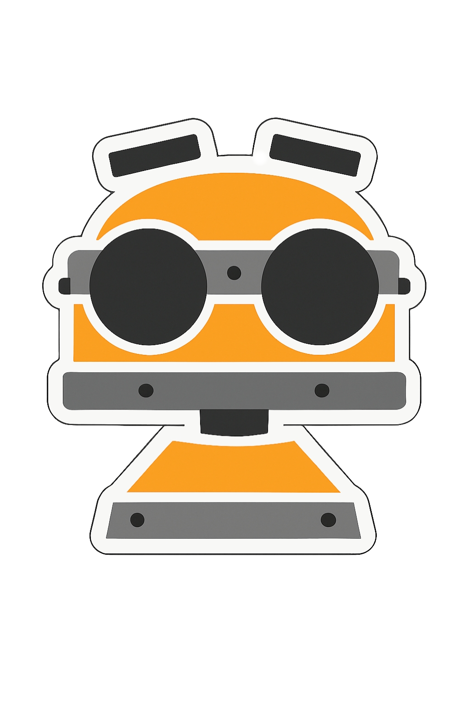
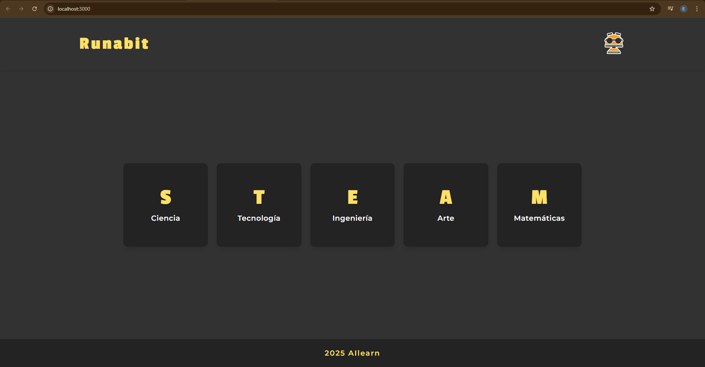
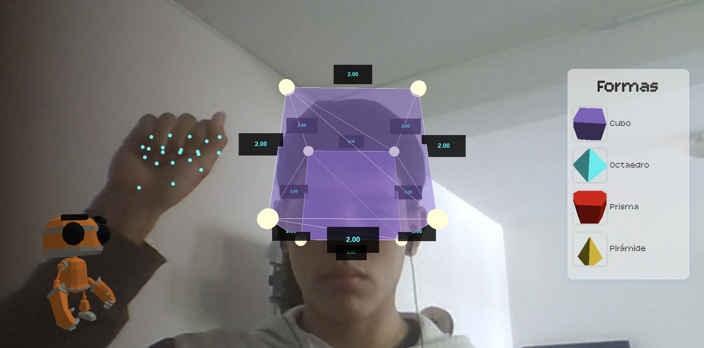
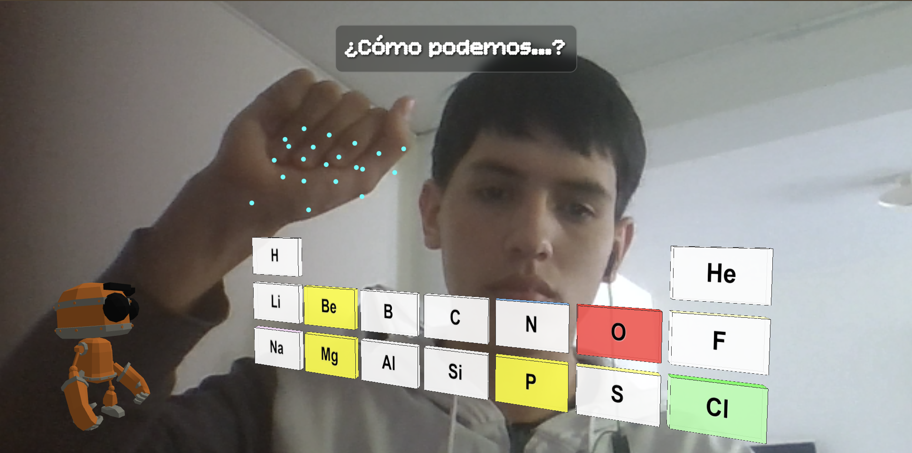
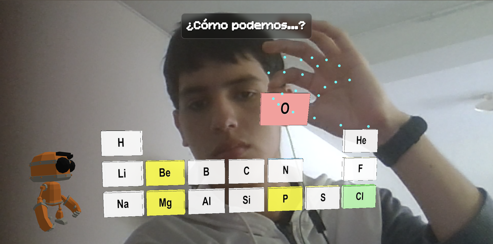
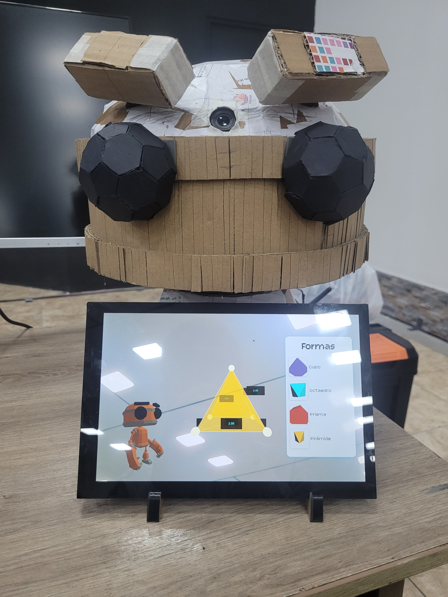
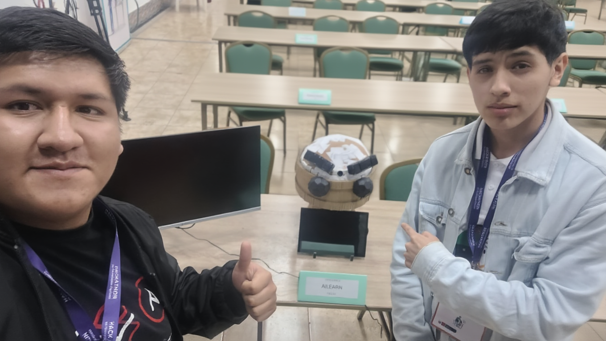

# Runabit

Este proyecto fue desarrollado por Edwar Silva y Adrián Coronel con el objetivo de aprovechar las herramientas modernas de inteligencia artificial, especialmente en el área de visión artificial y procesamiento de imágenes, para crear una solución educativa innovadora.
Nuestra propuesta consiste en dos componentes principales:

1. Una plataforma educativa interactiva basada en visión artificial.
2. Un robot amigable y didáctico que responde a los gestos del estudiante.
   
La plataforma tiene como propósito introducir métodos kinestésicos, visuales y didácticos que permitan mejorar la experiencia de aprendizaje. Buscamos que los estudiantes participen activamente, evitando el aburrimiento y promoviendo una interacción constante con el contenido educativo.
El robot complementa esta experiencia actuando como un facilitador del aprendizaje. A través de la detección de gestos corporales, movimientos de las manos o expresiones faciales, el robot es capaz de reaccionar de forma dinámica y amigable. Esta interacción convierte el proceso educativo en una experiencia más divertida, intuitiva y motivadora, permitiendo que los estudiantes aprendan mientras juegan e interactúan de manera natural.

## Plataforma Interactiva
  

La plataforma permite controlar todas las actividades mediante gestos de las manos, sin usar periféricos. Cada gesto activa una función específica, como seleccionar opciones, mover elementos o cambiar entre secciones.
Está conectada al robot, por lo que las acciones del estudiante generan respuestas inmediatas del robot, creando una experiencia fluida y dinámica dentro del entorno educativo.

### Matemáticas
  

En esta sección, los estudiantes interactúan con figuras y objetos tridimensionales para explorar conceptos de geometría.
Mediante gestos con la mano derecha pueden seleccionar figuras, y con la mano izquierda rotarlas para observarlas desde distintos ángulos.
También es posible modificar vértices y dimensiones, lo que permite entender las propiedades geométricas de cada objeto de manera práctica y visual.

### Ciencias 
  

En ciencias, los estudiantes trabajan con modelos tridimensionales de elementos y moléculas.
Los gestos permiten seleccionar, mover y rotar objetos para explorar relaciones y estructuras de manera intuitiva.
Aunque la función de unir elementos para formar moléculas aún está en desarrollo, la plataforma permite visualizar y manipular componentes, facilitando la comprensión de conceptos complejos mediante la interacción directa.

## Robot
### Estructura

El robot está inspirado en animaciones de Three.js, lo que se refleja en su forma y diseño. Su estructura está construida con la técnica de papercraft, utilizando cartón grueso reforzado con papel y goma, lo que permite que cada estudiante pueda replicarlo de manera sencilla usando materiales reciclables y amigables con el medio ambiente.

### Electrónica

El cerebro del proyecto está basado en una Raspberry Pi 5, que ejecuta localmente la plataforma interactiva y está conectada a una webcam comercial para la detección de gestos.
Un Arduino Uno recibe las órdenes de la Raspberry Pi y controla el movimiento de los servomotores mediante el módulo PCA9685. El robot cuenta con tres servomotores:

2 servomotores MG90S para mover las cejas.
1 servomotor MG996 para el movimiento de la cabeza.

La energía para los servomotores proviene de dos baterías de ion de litio 18650 conectadas en serie, proporcionando una alimentación estable y dedicada.

#### Componentes principales:
Raspberry Pi 5 – Procesador Broadcom 2711, Quad-core Cortex-A76 64-bit SoC @ 2.4GHz.
Arduino Uno (Rev3) – Controlador de los servomotores.
16-Channel 12-bit PCA9685 PWM/Servo Driver – Módulo para manejar los servos.
Sony Spresense Camera Board – Captura de video para la interacción con la plataforma.
Servomotores – 2 × MG90S (cejas), 1 × MG996 (cabeza).
Baterías – 2 × Li-ion 18650 conectadas en serie.

## Tecnologías utilizadas
La plataforma educativa está desarrollada combinando tecnologías web y herramientas de visión artificial:
- Node.js – Backend que permite la comunicación entre la plataforma y el robot.
- JavaScript – Lógica del cliente y detección de gestos.
- MediaPipe Hands – Reconocimiento en tiempo real de manos y gestos.
- Three.js – Animaciones y modelos 3D interactivos.
- HTML5 + CSS3 – Interfaz visual y estructura de la plataforma.

El robot utiliza electrónica accesible y programación en microcontroladores:
- Arduino Uno (C++ / Arduino IDE) – Control principal de los servomotores.
- PCA9685 – Módulo PWM para controlar múltiples servos.
- Servomotores (MG90S y MG996) – Movimiento de cejas y cabeza.
- Raspberry Pi 5 – Ejecución de la plataforma y procesamiento de visión artificial.
- Cámara Web – Captura de video para reconocimiento de gestos.

### Compatibilidad y despliegue: 
La plataforma es completamente multifuncional, ya que está desarrollada con tecnologías web.
Al alojarla en un hosting, puede ejecutarse directamente desde navegadores modernos en:
- Computadoras y Microcomputadoras (Windows, Linux, macOS)
- Tablets
- Teléfonos móviles
Esto permite que el proyecto sea accesible desde múltiples dispositivos sin necesidad de instalaciones adicionales, manteniendo el reconocimiento de gestos siempre que el dispositivo cuente con una cámara compatible.

## Equipo

Este repositorio tiene como propósito presentar la arquitectura, tecnologías y funcionamiento general del proyecto Runabit.
Los archivos incluidos muestran la integración entre visión artificial, animaciones 3D y control robótico, pero no buscan servir como guía de replicación paso a paso, ya que el enfoque principal es demostrar las capacidades tecnológicas de la plataforma y del robot.
